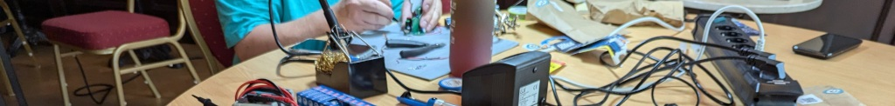

> Die nerdbridge ist der Treffpunkt computerbegeisteter Nerds aus Einbeck und Umgebung.
> Dabei geht es um alles was das Thema Computer weiträumig streift. Gerade auch das Basteln und Entdecken mit und am Computer soll gelebt werden. Daher ist jeder willkommen, egal welcher Wissensstand und welches Thema von Interesse ist.  

Diese GitLab Gruppe enthält Code Repos von Projekten die innerhalb der Gruppe durchgeführt wurden oder werden.

- [Unsere Website](https://nerdbridge.de)
- [Folien von Vorträgen](https://slides-9b2a50.huhu123.de/)
